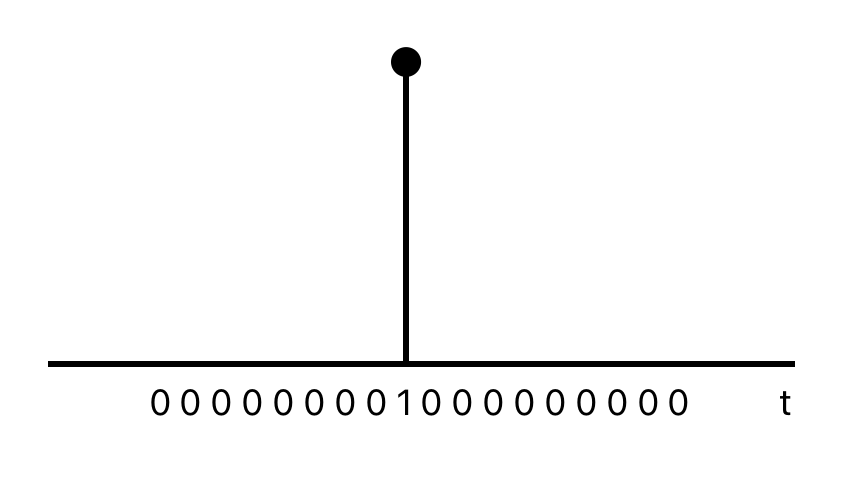
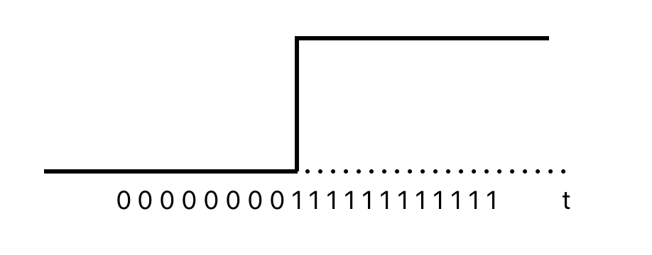
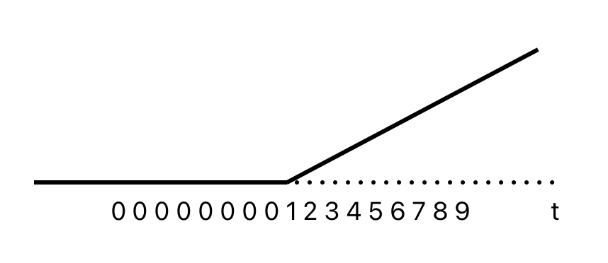

# Time series regression models

```{r ch07-ts-regression-1}

# loading libraries
library(tsibble)
library(tsibbledata)
library(tidyverse)
# to read data
library(rio)
library(ggplot2)
library(fabletools)
library(feasts)
library(fpp3)
library(latex2exp)
library(forecast)

```

[The source of the chapter](https://otexts.com/fpp3/regression.html)

> The basic concept is that we forecast the time series of interest $y$ assuming that it has a linear relationship with other time series $x$.

The **forecast variable** $y$ is **dependent variable**, regressand or explained variable. The **predictor variables** $x$ are **independent variable**, regressors or exploratory variable.

## The linear model

[The source of the section](https://otexts.com/fpp3/regression-intro.html)

### Simple linear regression

$$
y_t = \beta_0 + \beta_1x_{1,t} + \varepsilon_t
$$

The intercept $\beta_0$ represents the predicted value of $y$ when $x=0$. The slope $\beta_1$ represents the average predicted change in $y$ resulting from a one unit increase in $x$.

$\varepsilon_t$ or "error" represents a deviation from the underlying straight line model.

#### Example: US consumption expenditure

```{r ch07-ts-regression-2}

us_change |>
  pivot_longer(cols = c(Consumption, Income), names_to = 'Series') |>
  autoplot(value) +
  labs(y = '% change')

```

```{r ch07-ts-regression-3}

us_change |>
  model(lm = TSLM(Consumption ~ Income)) |>
  report()

```

$$
\hat y_t = 0.54 + 0.27x_t
$$

```{r ch07-ts-regression-4}

us_change |>
  ggplot(aes(x = Income, y = Consumption)) +
  labs(x = 'Income (quarterly % change)',
       y = 'Consumption (quarterly % change)') +
  geom_point() +
  geom_smooth(method = 'lm', se = F)

```

### Multiple linear regression

$$
y_t = \beta_0 + \beta_1x_{1,t} + \beta_2x_{2,t} + ... + \beta_kx_{k,t} + \varepsilon_t
$$

-   $y_t$ is the variable we want to predict: the "response" variable
-   Each $x_{j,t}$ is **numerical** and called a "predictor". They are usually assumed to be known for all past and future times.
-   The coefficients $\beta_1, ..., \beta_k$ measure the effect of each predictor after taking account of the all other predictors in the model.
-   $\varepsilon_t$ is a white noise error term

#### Example: US consumption expenditure

```{r ch07-ts-regression-5}

us_change |>
  pivot_longer(-Quarter) |>
  ggplot(aes(Quarter, value, color = name)) +
  geom_line() +
  facet_grid(name ~ ., scales = 'free_y') +
  guides(color = 'none') +
  labs(y = '% change')

```

```{r ch07-ts-regression-6, message=FALSE, warning=FALSE}

us_change |>
  GGally::ggpairs(column = 2:6)

```

### Assumptions

-   The model is a reasonable approximation to reality, the relationship between the forecast variable and the predictor variables satisfies this linear equation.
-   $\varepsilon_t$ have mean zero and are uncorrelated.
-   $\varepsilon_t$ are uncorrelated with aech $x_{j,t}$.
-   Errors are normally distributed with constant variance $\sigma^2$ in order to easily produce prediction intervals.

## Least squares estimation

[The source of the section](https://otexts.com/fpp3/least-squares.html)

The least squares principle provides a way of choosing the coefficients effectively by minimising the sum of the squared errors.

$$
\sum_{t=1}^T \varepsilon_t^2 = \sum_{t=1}^T (y_t - \beta_0 - \beta_1x_{1,t} - \beta_2x_{2,t}-...-- \beta_kx_{k,t})^2
$$

Finding the best estimates of the coefficients is colled **fitting** the model to the data, or **learning** or **training** the model.

#### Example: US consumption expenditure

$$
y_t = \beta_0 + \beta_1x_{1,t} + \beta_2x_{2,t} + \beta_3x_{3,t} + \beta_4x_{4,t} + \varepsilon_t
$$

-   $y$ is the percentage change in real personal consumption expenditure
-   $x_1$ is the percentage change in real personal disposable income
-   $x_2$ is the percentage change in industrial production
-   $x_3$ is the percentage change in personal savings
-   $x_4$ is the change in the unemployment rate

Fitting the model.

```{r ch07-ts-regression-7}

fit_lm <- us_change |>
  model(lm = TSLM(Consumption ~ Income + Production +
                                    Unemployment + Savings))

fit_lm |> report()

```

### Fitted values

Estimated coefficients:

$$
\hat y_t = \hat \beta_0 + \hat \beta_1x_{1,t} + \hat \beta_2x_{2,t} + ... + \hat \beta_kx_{k,t}
$$ \> **Note!** The predictions of the data used to estimate the model on the training set, not genuine forecasts of future values of $y$.

```{r ch07-ts-regression-8}

fit_lm |>
  augment() |>
  ggplot(aes(x = Quarter)) +
  geom_line(aes(y = Consumption, color = 'Actual Values')) +
  geom_line(aes(y = .fitted, color = 'Fitted Values')) +
  labs(y = NULL,
       title = 'Percentage change in US consumption expediture') +
  scale_color_manual(values = c('Actual Values' = 'black', 'Fitted Values' = 'orange')) +
  guides(color = guide_legend(title = NULL))

```

```{r ch07-ts-regression-9}

fit_lm |>
  augment() |>
  ggplot(aes(x = Consumption, y = .fitted)) +
  geom_point() +
  labs(y = 'Fitted (predicted values)',
       x = 'Data (actual values)',
       title = 'Percent change in US consumption expediture') +
  geom_abline(intercept = 0, slope = 1, color = 'blue')

```

### Goodness-of-fit

$R^2$ is the coefficient of determination, which can be calculated as the square of the correlation between the observed $y$ values and the predicted $\hat y$ values.

$$
R^2 = \frac {\sum (\hat y_t - \bar y)^2} {\sum (y_t - \bar y)^2}, R^2 \in [0, 1]
$$ \> **Important!** The value of $R^2$ will never decrease when adding an extra predictor to the model and this can lead to over-fitting.

> Validating a model's forecasting performance on the test data is much better than measuring the $R^2$ value on the training data.

### Standard error of the regression

$\hat \sigma_e$ is residual standard error.

$$
\hat \sigma_e = \sqrt {\frac 1 {T - k - 1} \sum_{t=1}^T e_t^2}
$$

where $k$ in the number of predictors in the model $T-k-1$ because there is estimated $k+1$ parameters (the intercept and a coefficient for each predictor variable)

## Evaluating the regression model

[The source of the section](https://otexts.com/fpp3/regression-evaluation.html)

$$
e_t = y_t - \hat y_t = y_t - \hat \beta_0 - \hat \beta_1x_{1,t} - \hat \beta_2x_{2,t} - ... - \hat \beta_kx_{k,t}
$$ Properties of residuals:

-   $\sum_{t=1}^T e_t = 0$ and $\sum_{t=1}^T x_{k,t}e_t = 0$ for all $k$ - $\varepsilon_t$ have mean zero and are uncorrelated, $NID(0, \sigma^2)$
-   $\varepsilon_t$ are uncorrepated with each $x_{j,t}$
    -   Timeplot, ACF, Histogram (`gg_tsresiduals()`)
    -   Against predictors (non-linearity)
    -   Against fitted values (heteroscedasticity)
    -   Against predictors not in the model (include predictor in the model)

Expect to see scatterplots resembling a horizontal band with no values too far from the band and no patterns such as curvature or increasing spread.

### ACF plot of residuals

We should **always** look ar an ACF plot of the residuals to be sure there are no information left in the residual over which we should be accounted for in the model in order to obtain better forecast.

### Histogram of residuals

We should **always** check whether the residuals are normally distributed using histogram, qq-plot, or/and formal tests. It does make the calculation of prediction intervals much easier.

```{r ch07-ts-regression-10}

fit_lm |> gg_tsresiduals()

```

```{r ch07-ts-regression-11}

fit_lm |>
  augment() |>
  features(.innov, ljung_box, lag = 10)

```

**Conclusion:**

-   Changing variation over time - heteroscedasticity could affect accuracy of prediction intervals
-   The histogram is slightly skewed
-   There is significant spike at lag 7.

### Residual plots against predictors

> We would expect the residuals to be randomly scattered without showing any systematic patterns.

Examine scatterplots of the residuals against each of the predictor variables. If the plots show a pattern then there is the relationship is nonlinear.

```{r ch07-ts-regression-12}

us_change |>
  left_join(residuals(fit_lm), by = 'Quarter') |>
  pivot_longer(Income:Unemployment, names_to = 'regressor', values_to = 'x') |>
  ggplot(aes(x = x, y = .resid)) +
  geom_point() +
  facet_wrap(. ~ regressor, scales = 'free_x') +
  labs(y = 'Residuals', x = '')

```

> **Important!** Plot the residuals against any predictors that are not in the nodel. If any pattern are shown, these predictors are needed to be added to the model.

### Residual plots against fitted values

A plot of the residuals against the fitted values should show no pattern, otherwise there may be **heteroscedasticity** in the errors (unconstant variance).

```{r ch07-ts-regression-13}

fit_lm |>
  augment() |>
  ggplot(aes(x = .fitted, y = .resid)) +
  geom_point() +
  labs(x = 'Fitted', y = 'Residuals', title = 'Fitted vs Residuals')

```

The error are **homoscedastic**.

### Outliers and influential observations

> Observations that have a large influence on the estimated coefficients of a regression model are called **influential observations**.

```{r ch07-ts-regression-14}

us_change |>
  ggplot(aes(x = Income, y = Consumption)) +
  geom_point() +
  geom_smooth(method = 'lm', se = F)

```

```{r ch07-ts-regression-15}

us_change2 <- us_change

bind_rows(us_change2,
          us_change2 |>
                  new_data(n = 1, keep_all = T) |>
                  mutate(Consumption = -4, Income = 6)) |>
  ggplot(aes(x = Income, y = Consumption)) +
  geom_point() +
  geom_smooth(method = 'lm', se = F)

```

### Spurious regression

```{r ch07-ts-regression-16}

fit <- aus_airpassengers |>
  filter(Year <= 2011) |>
  left_join(guinea_rice, by = 'Year') |>
  model(TSLM(Passengers ~ Production))

report(fit)
  

```

```{r ch07-ts-regression-17}

fit |>
  gg_tsresiduals()

```

## Some useful predictors

[The source of the section](https://otexts.com/fpp3/useful-predictors.html)

### Trend

Linear trend:

-   $t = 1, 2, ..., T$
-   Using $x_{1,t} = t$ as predictor
-   Trend variable can be specified by `trend()` in the `TSLM()`
-   Strong assumption that trend will continue

```{r ch07-ts-regression-18}

aus_airpassengers |>
  model(TSLM(Passengers ~ trend())) |>
  augment() |>
  autoplot(Passengers) +
  geom_line(aes(y = .fitted), color='blue') +
  labs(title = 'Linear trend of number of air passengers in Australia')

```

### Dummy variables

To make numerical variable from categorical variable use dummy variable which takes 1 if **yeas** and 0 if **no**. To remove the effect of outliers, for example if special event has occured, saying the Rio de Janeiro summer Olympics in 2016, the dummy variable takes value 1 for the observations which have overlapped with the games and 0 everywhere else.

> `TSLM()` will automatically handle this case if you specify a factor variable as a predictor.

### Seasonal dummy variables

For quarterly data.

|     | $d_{1, t}$ | $d_{2, t}$ | $d_{3, t}$ |
|:----|------------|------------|------------|
| Q1  | 1          | 0          | 0          |
| Q2  | 0          | 1          | 0          |
| Q3  | 0          | 0          | 1          |
| Q4  | 0          | 0          | 0          |
| Q1  | 1          | 0          | 0          |

The interpretation of each of the coefficients associated with the dummy variables is that it is a measure of the effect of that category relative to the omitted category. In the above example, the coefficient of $d_{1,t}$ associated with Q1 will measure the effect of Q1 on the forecast variable compared to the effect of Q4 (omitted dummy variable).

The model using a linear trend and quarterly dummy variables.

$$
y_t = \beta_0 + \beta_1t + \beta_2d_{2, t} + \beta_3d_{3, t} + \beta_4d_{4, t} + \varepsilon_t
$$

where $d_{i, t} = 1$ if $t$ is in quarter $i$ and 0 otherwise.

```{r ch07-ts-regression-19}

recent_production <- aus_production |>
  filter(year(Quarter) >= 1992)

recent_production |>
  autoplot(Beer) +
  labs(y = 'Megalitres',
       title = 'Australian quarterly beer production')

```

```{r ch07-ts-regression-20}

fit_beer <- recent_production |>
  model(TSLM(Beer ~ trend() + season()))

report(fit_beer)

```

**Interpretation:** The first quarter variable has been omitted, so the coefficients associated with the other quarters are measures of the difference between those quarters and the first quarter. There is an average downward trend of -0.34 megalitres per quarter. On average, the second quarter has production of 34.7 megalitres lower than the first quarter, the third quarter has production of 17.8 megalitres lower than the first quarter, and the fourth quarter has production of 72.8 megalitres higher than the first quarter.

#### Beware of using dummy variables

-   Using one dummy for each category gives too many dummy variables
-   The regression will then be singular and inestimable
-   Either omit the constant, or omit the dummy for one category
-   The coefficients of the dummies are relative to the omitted category

#### Example

```{r ch07-ts-regression-21}

fit_beer |>
  augment() |>
  ggplot(aes(x = Quarter)) +
  geom_line(aes(y = Beer, color = 'Data')) +
  geom_line(aes(y = .fitted, color = 'Fitted')) +
  scale_color_manual(values = c(Data = 'black', Fitted = 'orange')) +
  labs(y = 'Megalitres',
       title = 'Australian quarterly beer production') +
  guides(color = guide_legend(title = 'Series'))

```

```{r ch07-ts-regression-22}

fit_beer |>
augment() |>
  ggplot(aes(x = Beer, y = .fitted,
             color = factor(quarter(Quarter)))) +
  geom_point() +
  labs(y = "Fitted", x = "Actual values",
       title = "Australian quarterly beer production") +
  geom_abline(intercept = 0, slope = 1) +
  guides(colour = guide_legend(title = "Quarter"))

```

#### Uses of dummy variables

**Seasonal dummies**

-   For **quarterly** data use **3** dummies
-   For **monthly** data use **11** dummies
-   For **daily** data use **6** dummies
-   For **weekly** data **DO NOT USE** dummies, use [Fourier](#fourier) instead.

**Outliers**

-   If there is an outlier, use a dummy variable to remove its effect.

**Public holidays**

-   For daily data: if it is a public holiday, dummy = 1, otherwise dummy = 0

### Intervention variables

**Spikes**\

Equivalent to a dummy variable for handling an outlier.



**Steps**\

Variable takes value 0 before the intervention and 1 afterwards.

 **Change of slope**\

Variables take values 0 before the intervention and values {1, 2, 3, ...} afterwards.



###Holidays

**For monthly data**\

-   Christmas: always in December so part of monthly seasonal effect
-   Easter: use a dummy variable $v_t = 1$ if any part of Easter is in that month, $v_t = 0$ otherwise.
-   Ramadan and Chinese new year similar

> **Important!** If the public holiday starts in one month and finishes in the another, the dummy variable is split proportionally between months.

### Trading days

-   The number of trading days in each month can be included as a predictor
-   Alternative:
    -   $x_1$ = number of Mondays in month
    -   $x_2$ = number of Tuesdays in month
    -   $x_3$ = number of Wednesday in month
    -   $x_4$ = number of Thursday in month
    -   $x_5$ = number of Friday in month
    -   $x_6$ = number of Saturday in month
    -   $x_7$ = number of Sunday in month

### Distributed lags

Since the effect of advertising can last beyond the actual campaign, we need to include lagged values of advertising expenditure.

-   $x_1$ = advertising for previous month
-   $x_2$ = advertising for two months previously
-   ...
-   $x_2$ = advertising for $m$ months previously

<a id="fourier"></a> \### Fourier series

-   For long seasonal perions
-   An alternative to using seasonal dummy variables

If $m$ is the seasonal pattern, then

$$
x_{1,t} = sin\left(\frac {2\pi t} m \right), x_{2,t} = cos \left( \frac {2\pi t} m \right), \\
x_{3,t} = sin\left(\frac {4\pi t} m \right), x_{4,t} = cos \left( \frac {4\pi t} m \right), \\
x_{5,t} = sin\left(\frac {6\pi t} m \right), x_{6,t} = cos \left( \frac {6\pi t} m \right), \\
$$

```{r ch07-ts-regression-23}

recent_production |>
  model(TSLM(Beer ~ trend() + fourier(K = 2))) |>
  report()

```

$K = m/2$, where $m$ is the seasonal period. Using maximum allowed $K$ produces the results that are identical to those when using seasonal dummy variables.

```{r ch07-ts-regression-24}

recent_production |>
  model(trend_season_linear_regression = TSLM(Beer ~ trend() + season()),
        harmonic_regression = TSLM(Beer ~ trend() + fourier(K = 2))) |>
  report()

```

## Selecting predictors

[The source of the section](https://otexts.com/fpp3/selecting-predictors.html)

The measures of predictive accuracy which can be used to find the best model:

```{r ch07-ts-regression-25}

fit_lm |>
  glance() |>
  select(adj_r_squared, CV, AIC, AICc, BIC)

```

### Adjusted $R^2$

$R^2$ (coefficient of determination) measures how well the model fits the historical data, but not well the model will forecast future data.

$$
R^2 = \frac {\sum (\hat y_t - \bar y)^2} {\sum (y_t - \bar y)^2}
$$

Minimising the SSE is equivalent to maximising $R^2$. It is __not__ a valid way of selecting predictors.

$$
SSE = \sum_{t=1}^T e_t^2
$$
Adjusted $R^2$ ($\bar R^2$) will no longer increase with each added predictor.

$$
Adj. R^2 = \bar R^2 = 1 - (1-R^2)\frac {T-1} {T-k-1}
$$

where $T$ is the number of observations, $k$ is the number of predictors. Maximising $\bar R^2$ is equivalent to minimising the standard error $\hat \sigma^2$.

### Cross-validation

1. Remove observation $t$ from the data set, and fit the model using the remaining data.Then compute the error ($e_t^* = y_t - \hat y_t$) for the omitted observation.
2. Repeat step 1 for $t = 1,2,...,T$
3. Compute the MSE from $e_1^*,...,e_T^*$ - CV

> __Note!__ The best model is the one with the smallest value of CV


### Akaike’s Information Criterion

$$
AIC = T \times log \left( \frac {SSE} T\right) + 2(k + 2)
$$
where $T$ is the number of observations used for estimation and $k$ is the number of predictors in the model.

> __Note!__ The model with the minimum value of the AIC is often the best model for forecasting. For large values of $T$, minimising the AIC is equivalent to minimising the CV value.

### Corrected Akaike’s Information Criterion

$$
AIC_c = AIC + \frac {2(k+1)(k+3)} {T-k-3}
$$
> __Note!__ The model with the minimum value of the $AIC_c$ is often the best model for forecasting.

### Schwarz’s Bayesian Information Criterion

$$
BIC = T \times log \left( \frac {SSE} T \right) + (k+2) \times log (T)
$$
> __Note!__ The model with the minimum value of the $BIC$ is often the best model for forecasting.

### Stepwise regression

__Backwards stepwise regression:__

- Start with the model containing all potential predictors.
- Remove one predictor at a time. Keep the model if it improves the measure of predictive accuracy.
- Iterate until no further improvement.

If the number of predictors is too large, use __forward stepwise regression__ instead.

- Start with a model that includes only the intercept. 
- Predictors are added one at a time, and the one that most improves the measure of predictive accuracy is retained in the model. 
- The procedure is repeated until no further improvement can be achieved.

> __Note!__ Any stepwise approach is not guaranteed to lead to the best possible model, but it almost always leads to a good model. 


## Forecasting with regression

[The source of the section](https://otexts.com/fpp3/forecasting-regression.html)


```{r ch07-ts-regression-26}

recent_production <- aus_production |>
  filter(year(Quarter) >= 1992) 

fit_beer <- recent_production |>
  model(TSLM(Beer ~ trend() + season()))

fc_beer <- fit_beer |> forecast()

fc_beer |>
  autoplot(recent_production) +
  labs(
    title = "Forecasts of beer production using regression",
    y = "megalitres"
  )

```

### Scenario based forecasting

```{r ch07-ts-regression-27}

fit <- us_change |>
  model(
     lm = TSLM(Consumption ~ Income + Savings + Unemployment)
  )

future_scenarios <- scenarios(
  Increase = new_data(us_change, 4) |>
              mutate(Income = 1, Savings = 0.5, Unemployment = 0),
  Decrease = new_data(us_change, 4) |>
              mutate(Income = -1, Savings = -0.5, Unemployment = 0),
  names_to = 'Scenario'
)

fc <- fit |> forecast(new_data = future_scenarios)

us_change |>
  autoplot(Consumption) +
  autolayer(fc) +
  labs(title = "US consumption", y = "% change")

```

### Prediction intervals

```{r ch07-ts-regression-28}

fit_cons <- us_change |>
  model(TSLM(Consumption ~ Income))
new_cons <- scenarios(
  "Average increase" = new_data(us_change, 4) |>
    mutate(Income = mean(us_change$Income)),
  "Extreme increase" = new_data(us_change, 4) |>
    mutate(Income = 12),
  names_to = "Scenario"
)
fcast <- forecast(fit_cons, new_cons)

us_change |>
  autoplot(Consumption) +
  autolayer(fcast) +
  labs(title = "US consumption", y = "% change")

```

## Nonlinear regression

[The source of the section](https://otexts.com/fpp3/nonlinear-regression.html)

Non-linear regression:
$$
ln(y) = \beta_0 + \beta_1ln(x) +\varepsilon
$$

$\beta_1$ is the average percentage change in $y$ resulting from a 1% increaqsing in $x$.
In the case what variable $x$ contains zeros, we use the transformation $ln(x+1)$.

### Forecasting with a nonlinear trend

```{r ch07-ts-regression-29}

boston_men <- boston_marathon |>
  filter(Year >= 1924) |>
  filter(Event == "Men's open division") |>
  mutate(Minutes = as.numeric(Time)/60)

# linear trend
boston_men |>
  autoplot(Minutes) +
  geom_smooth(method = 'lm', se = FALSE) +
  labs(title = 'Boston marathon winning times')

```

```{r ch07-ts-regression-30}

# residuals from linear trend
boston_men |>
  model(TSLM(Minutes ~ trend())) |>
  gg_tsresiduals() +
  labs(title = 'Residuals from a linear trend')

```

```{r ch07-ts-regression-31}

# exponential trend
fit_exp <- boston_men |>
  model(TSLM(log(Minutes) ~ trend()))
  
fit_exp |> 
  augment() |>
  autoplot(Minutes) +
  geom_line(aes(y = .fitted), color = 'blue') +
  labs(title = 'Boston marathon winning times (exp trend)')

```

```{r ch07-ts-regression-32}

fit_exp |>
  gg_tsresiduals() +
  labs(title = 'Residuals from an exponential trend')

```
### Piacewise regression

```{r ch07-ts-regression-33}

fit_trends <- boston_men |>
  model(
    linear = TSLM(Minutes ~ trend()),
    exponential = TSLM(log(Minutes) ~ trend()),
    piecewise = TSLM(Minutes ~ trend(knots = c(1950, 1980)))
  )
fc_trends <- fit_trends |> forecast(h = 10)

boston_men |>
  autoplot(Minutes) +
  geom_line(data = fitted(fit_trends),
            aes(y = .fitted, colour = .model)) +
  autolayer(fc_trends, alpha = 0.5, level = 95) +
  labs(y = "Minutes",
       title = "Boston marathon winning times")

```

## Correlation, causation and forecasting

[The source of the section](https://otexts.com/fpp3/causality.html)

### Correlation is not causation

It is important not to confuse correlation with causation, or causation with forecasting. A variable $x$ may be useful for forecasting a variable $y$ , but that does not mean $x$ is causing $y$. It is possible that $x$ is causing $y$ , but it may be that $y$ is causing $x$ , or that the relationship between them is more complicated than simple causality.

### Forecasting with correlated predictors

When two or more predictors are highly correlated it is always challenging to accurately separate their individual effects. Having correlated predictors is not really a problem for forecasting, as we can still compute forecasts without needing to separate out the effects of the predictors. 

### Multicollinearity and forecasting

A closely related issue is multicollinearity, which occurs when similar information is provided by two or more of the predictor variables in a multiple regression.

An example of this problem is the dummy variable trap discussed in Section 7.4. Suppose you have quarterly data and use four dummy variables, $d_1, d_2, d_3$ and $d_4$. Then $d_4 = 1 - d_1 - d_2 - d_3$, so there is perfect correlation between $d_4$ and $d_1 + d_2 + d_3$.

> __Note!__ If you are using good statistical software, if you are not interested in the specific contributions of each predictor, and if the future values of your predictor variables are within their historical ranges, there is nothing to worry about — multicollinearity is not a problem except when there is perfect correlation.

## Exercises

1.

```{r ch07-ts-regression-34}

jan14_victoria_elec <- vic_elec |>
  filter(yearmonth(Time) == yearmonth('2014 Jan')) |>
  index_by(Date = as_date(Time)) |>
  summarise(Demand = sum(Demand),
            Temperature = max(Temperature))

jan14_victoria_elec

```

```{r ch07-ts-regression-35}

# a.
jan14_victoria_elec |>
  autoplot(Demand) +
  labs(title = 'Electricity demand on 2014 Jan', y = 'MWh')

```


```{r ch07-ts-regression-36}

fit_elec <- jan14_victoria_elec |>
              model(TSLM(Demand ~ Temperature))

fit_elec |> report()


```

```{r ch07-ts-regression-37}

jan14_victoria_elec |>
  ggplot(aes(x=Temperature, y = Demand)) +
  geom_point() +
  geom_smooth(method = 'lm', se = FALSE) +
  labs(title = 'Relationship between temperature and electricity demand',
       y = 'Demand, MWh', x = 'Temperature, C')

```

January is a summer month in Australia, the more temperature outside was the more air conditioning is used inside.


```{r ch07-ts-regression-38}

# b. 

fit_elec |>
  gg_tsresiduals() +
  labs(title = 'Residuals from the model')

```

```{r ch07-ts-regression-39}

# c.

fc <- fit_elec |>
  forecast(
    new_data = scenarios(
              'max15' = new_data(jan14_victoria_elec, 1) |> mutate(Temperature = 15),
              'max35' = new_data(jan14_victoria_elec, 1) |> mutate(Temperature = 35), names_to = 'Scenarios')
  )

jan14_victoria_elec |> 
  autoplot(Demand) +
  autolayer(fc)

```


```{r ch07-ts-regression-40}

# d.

fc <- fit_elec |>
  forecast(
    new_data = scenarios(
              'max15' = new_data(jan14_victoria_elec, 2) |> mutate(Temperature = 15),
              'max35' = new_data(jan14_victoria_elec, 2) |> mutate(Temperature = 35), names_to = 'Scenarios')
  )

jan14_victoria_elec |> 
  autoplot(Demand) +
  autolayer(fc)

```

```{r ch07-ts-regression-41}

# e.
vic_elec |>
  index_by(Date = as_date(Time)) |>
  summarise(
    Demand = sum(Demand),
    Temperature = max(Temperature)
  ) |>
  ggplot(aes(x = Temperature, y = Demand)) +
  geom_point()


```

The Temperature and the Demand do not have linear relationship, so the linear model might not be the best choice.

2.

```{r ch07-ts-regression-42}

# a.

olympic_running |>
  autoplot(Time) +
  facet_grid(Length ~ Sex, scales = 'free_y') +
  theme(legend.position = 'none')

```

```{r ch07-ts-regression-43}

# b.

fit <- olympic_running |>
  model(TSLM(Time ~ trend()))
  
aug <- fit |> augment()

# get the regression lines
olympic_running |>
  autoplot(Time) +
  autolayer(aug, .fitted) +
  facet_grid(Length ~ Sex, scales = 'free_y') +
  theme(legend.position = 'none')

```

```{r ch07-ts-regression-44}

# get average rate per year
fit |>
  tidy() |>
  filter(term == 'trend()') |>
  select(Length, Sex, `Average rate per year`=estimate)
  
```

```{r ch07-ts-regression-45}

# c.

# prot the residuals vs year
fit |>
  augment() |>
  ggplot(aes(x = Year, y = .resid)) +
  geom_line() +
  facet_grid(Length ~ Sex, scales = 'free_y')

```

```{r ch07-ts-regression-46}

# d.

olympic_running |>
  autoplot(Time) +
  autolayer(fit |>
  forecast(h=2)
) +
  facet_grid(Length ~ Sex, scales = 'free_y') +
  theme(legend.position = 'none')

```

4.

```{r ch07-ts-regression-47}

souvenirs

```

```{r ch07-ts-regression-48}

# a.
souvenirs |>
  gg_tsdisplay(Sales)

```

```{r ch07-ts-regression-49}

# b.
souvenirs |>
  gg_tsdisplay(log(Sales))

# Because of the fluctuation of the variance the logarithms should be applied 
# to make stationary time series.

```

```{r ch07-ts-regression-50}

# c.
souvenirs_log <- souvenirs |>
  mutate(Sales_log = log(Sales), 
         `Surfing Festival` = ifelse(year(Month) >= 1988 & 
                                     month(Month) == 3, 1, 0))
fit <- souvenirs_log |>
  model(TSLM(Sales_log ~ trend() + season() + `Surfing Festival`))

```


```{r ch07-ts-regression-51}

# d.
fit |>
  augment() |>
  ggplot(aes(x = Month, y = .resid)) +
  geom_point() +
  labs(title = 'Residuals vs Time')

```

```{r ch07-ts-regression-52}

fit |>
  augment() |>
  ggplot(aes(x = .fitted, y = .resid)) +
  geom_point() +
  labs(title = 'Residuals vs Fitted')

```


```{r ch07-ts-regression-53}

# e.
fit |>
  augment() |>
  ggplot(aes(x = factor(month(Month)), y = .resid)) +
  geom_boxplot() +
  labs(title = 'Box plot per Month')

```

```{r ch07-ts-regression-54}

# f.
fit |> report()

```

```{r ch07-ts-regression-55}

# g.

fit |>
  augment() |>
  features(.resid, ljung_box, lag = 12)

# H0 is rejected, there is autocorrelation in the residuals

```

```{r ch07-ts-regression-56}

# h.
fc <- fit |>
  forecast(new_data = scenarios(new_data(souvenirs, 12) |>
                                  mutate(`Surfing Festival` = ifelse(month(Month) == 3, 1, 0)),
                                new_data(souvenirs, 24) |>
                                  mutate(`Surfing Festival` = ifelse(month(Month) == 3, 1, 0)),
                                new_data(souvenirs, 36) |>
                                  mutate(`Surfing Festival` = ifelse(month(Month) == 3, 1, 0))))
souvenirs_log |>
  autoplot(Sales_log) +
  autolayer(fc |> mutate(.scenario = factor(.scenario))) +
  facet_grid(.scenario ~ ., scales = 'free_y')

```

5.

```{r ch07-ts-regression-57}

gasoline <- us_gasoline |>
  filter(year(Week) <= 2004)

gasoline |>
  autoplot(Barrels) +
  labs(y = 'Million barrels per day',
       title = 'Weekly data for supplies of US finished motor gasoline product')

```

```{r ch07-ts-regression-58, fig.height=26, fig.width=6}

plots <- list()
fits <- list()
minACCc = 10000
for (i in seq(52/2)) {
  fit <- gasoline |>
  model(TSLM(Barrels ~ trend() + fourier(K=i)))
  fits[[i]] <- fit # keep fit
  AICc <- round(glance(fit)[['AICc']], 2)
  if(AICc < minACCc){
    minACCc <- AICc
  }
  plots[[i]] <- fit |>
    augment() |>
    ggplot(aes(x = Week, y = Barrels)) +
    geom_line(aes(color = 'Actual Data')) +
    geom_line(aes(y = .fitted, color = 'Fitted')) +
    theme(legend.position = 'none') +
    scale_color_manual(values = c('Actual Data'='darkgray', 'Fitted'='red')) +
    xlab(paste("K=", i, "   AICc=", AICc))
}

do.call(gridExtra::grid.arrange, c(plots, ncol = 1))

```

```{r ch07-ts-regression-59}

# b.
K = which.min(sapply(fits, function(fit) {
  round(glance(fit)[['AICc']], 2)
}))

print(paste('Optimal K =', K, ', AICc = ', round(glance(fits[[K]])[['AICc']], 2)))

```

```{r ch07-ts-regression-60}

fits[[K]] |>
    augment() |>
    ggplot(aes(x = Week, y = Barrels)) +
    geom_line(aes(color = 'Actual Data')) +
    geom_line(aes(y = .fitted, color = 'Fitted')) +
    theme(legend.position = 'none') +
    scale_color_manual(values = c('Actual Data'='darkgray', 'Fitted'='red')) +
    xlab(paste("K=", K, "   AICc=", round(glance(fits[[K]])[['AICc']], 2)))

```

```{r ch07-ts-regression-61}

# c.

fits[[K]] |>
  gg_tsresiduals()

```

```{r ch07-ts-regression-62}

fits[[K]] |>
  augment() |>
  features(.innov, ljung_box)

# H0 is rejected, the residuals are autocorrelated.

```

```{r ch07-ts-regression-63}

# d.

us_gasoline |>
  filter(year(Week) < 2006) |>
  autoplot(Barrels) +
  autolayer(fits[[K]] |>
              forecast(h = 52), color='red', level=NULL)

```
6.

```{r ch07-ts-regression-64}

# a.
auf <- global_economy |>
  filter(Country == 'Afghanistan')

auf |> autoplot(Population) +
  labs(title = 'Population of Afghanistan')

```

```{r ch07-ts-regression-65}

# b.

fit_trends <- auf |>
  model(
    linear_trend = TSLM(Population ~ trend()),
    piecewise = TSLM(Population ~ trend(knots = c(1980, 1989)))
  )

auf |>
  autoplot(Population) +
  geom_line(data = fitted(fit_trends),
            aes(y = .fitted, color = .model)) +
  labs(title = 'Population of Afghanistan')

```

```{r ch07-ts-regression-66}

fc_trends <- fit_trends |> forecast(h = 5)

auf |>
  autoplot(Population) +
  geom_line(data = fitted(fit_trends),
            aes(y = .fitted, color = .model)) +
  autolayer(fc_trends, alpha = 0.5) +
  labs(title = 'Population of Afghanistan')

```

