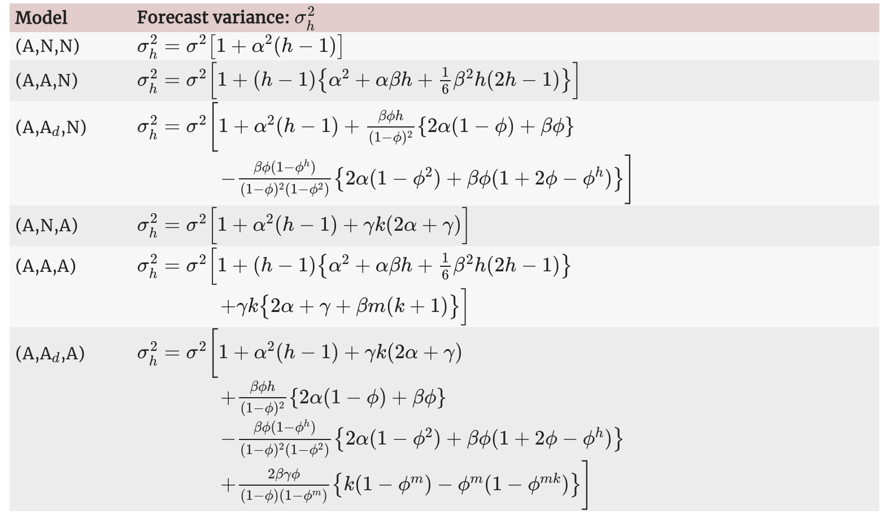

# Exponential Smoothing

```{r ch08-ts-exp-smoothing-1}

# loading libraries
library(tsibble)
library(tsibbledata)
library(tidyverse)
# to read data
library(rio)
library(ggplot2)
library(fabletools)
library(feasts)
library(fpp3)
library(latex2exp)
library(forecast)
library(fma)

```

[The source of the chapter](https://otexts.com/fpp3/expsmooth.html)

## Simple exponential smoothing

[The source of the section](https://otexts.com/fpp3/ses.html)

The SES method is suitable for forecasting data with no clear trend or
seasonal pattern.

```{r ch08-ts-exp-smoothing-2}

algeria_economy <- global_economy |>
  filter(Country == 'Algeria')

algeria_economy |>
  autoplot(Exports) +
  labs(y = '% of GDP', title = 'Exports: Algeria')

```

> Forecasts are calculated using weighted averages, where the weights
> decrease exponentially as observations come from further in the past
> --- the smallest weights are associated with the oldest observations.

$$
\hat y_{T+1|T} = \alpha y_T + \alpha(1 - \alpha)y_{T-1} +\alpha(1 - \alpha)^2y_{T-1}+...
$$ 

where $0 \le \alpha \le 1$ is the smoothing parameter.

### Weighted average form

$$
\hat y_{T+1|T} = \alpha y_T + (1-\alpha) \hat y_{T|T-1}
$$ where $0 \le \alpha \le 1$ is the smoothing parameter.

$$
\hat y_{T+1|T} = \sum_{j=0}^{T-1} \alpha(1-\alpha)^j y_{T-j} + (a-\alpha)^T\ell_0
$$

> The weighted average form leads to the same forecast equation of
> simple exponential smoothing.

### Component form

Forecast:

$$
\hat y_{t+h|t} = \ell_t
$$ Smoothing:

$$
\ell_t = \alpha y_t + (1- \alpha)\ell_{t-1}
$$

### Flat forecast

$$
\hat y_{T+h|T} = \hat y_{T+1|T} = \ell_T, \space \space \space h = 2,3,...
$$ \> That is, all forecasts take the same value, equal to the last
level component. Remember that these forecasts will only be suitable if
the time series has no trend or seasonal component.

### Optimisation

The unknown parameters ($\alpha$) and the initial values ($\ell_0$) for
any exponential smoothing method can be estimated by minimising the SSE.

$$
SSE = \sum_{t=1}^T(y_t - \hat y_{t|t-1})^2 = \sum_{t=1}^T e_t^2
$$

where $e_t = y_t - \hat y_{t|t-1}$ for $t=1,...,T$

### Example: Algerian exports

Fit the model ETS(ANN).

```{r ch08-ts-exp-smoothing-3}

# Estimate parameters
fit <- algeria_economy |>
  model(ETS(Exports ~ error("A") + trend("N") + season("N")))
fc <- fit |>
  forecast(h = 5)

```

Model report.

```{r ch08-ts-exp-smoothing-4}

fit |> report()

```

The 5-step forecast.

```{r ch08-ts-exp-smoothing-5}

fc

```

```{r ch08-ts-exp-smoothing-6}

fc |>
  autoplot(algeria_economy) +
  autolayer(fit |> augment(), .fitted, color = 'blue') +
  labs(y="% of GDP", title="Exports: Algeria") +
  guides(colour = "none")

```

## Methods with trend

[The source of the section](https://otexts.com/fpp3/holt.html)

### Holt's linear trend method

Forecast: $$
\hat y_{t+h|t} = \ell_t + hb_t
$$

Level: $$
\ell_t = \alpha y_t + (1-\alpha)(\ell_{t-1} + b_{t-1})
$$

Trend: $$
b_t = \beta(\ell_t - \ell_{t-1}) + (1-\beta)b_{t-1}
$$

Parameters:

-   $\ell_t$ - the level fot he time series at time $t$
-   $b_t$ trend (slope) of the time series at time $t$
-   $\alpha$ - the smoothing parameter for the level
    $0 \le \alpha \le 1$
-   $\beta$ smoothing parameter for the trend $0 \le \beta \le 1$

#### Example: Australian population

```{r ch08-ts-exp-smoothing-7}

aus_economy <- global_economy |>
  filter(Code == "AUS") |>
  mutate(Pop = Population / 1e6)
autoplot(aus_economy, Pop) +
  labs(y = "Millions", title = "Australian population")

```

```{r ch08-ts-exp-smoothing-8}

aus_economy |>
  gg_tsdisplay()

```

There are trend and no seasonality in the time series, so use
ETS(**AAN**) - **A**dditive error, **A**dditive trend and
**N**on-seasonality.

Fit the model and forecast.

> The smoothing parameters, $\alpha$ and $\beta$, and the initial values
> $\ell_0$ and $b_0$ are estimated by minimising the SSE for the
> one-step training errors.

```{r ch08-ts-exp-smoothing-9}

# ETS(AAN) - Additive error, Additive trend and non-seasonality
aus_economy |>
  model(AAN = ETS(Pop ~ error('A') + trend('A') + season('N'))) |>
  forecast(h = 10) |>
  autoplot(aus_economy) +
    labs(y = "Millions", title = "Australian population forecast ETS(AAN)")

```

> **Note!** The forecasts generated by **EST(AAN)** display a constant
> trend (increasing or decreasing) indefinitely into the future.

### Damped trend methods

Forecast: $$
\hat y_{t+h|t} = \ell_t + \left( \sum_{t=1}^h {\phi}^h \right) \times hb_t
$$

Level: $$
\ell_t = \alpha y_t + (1-\alpha)(\ell_{t-1} + \phi b_{t-1})
$$

Trend: $$
b_t = \beta(\ell_t - \ell_{t-1}) + (1-\beta)\phi b_{t-1}
$$

Parameters:

-   $\ell_t$ - the level fot he time series at time $t$
-   $b_t$ trend (slope) of the time series at time $t$
-   $\alpha$ - the smoothing parameter for the level
    $0 \le \alpha \le 1$
-   $\beta$ smoothing parameter for the trend $0 \le \beta \le 1$
-   $\phi$ a damping parameters $0 \le \phi \le 1$

> In practice, $\phi$ is rarely less than 0.8 as the damping has a very
> strong effect for smaller values. Values of $\phi$ close to 1 will
> mean that a damped model is not able to be distinguished from a
> non-damped model. For these reasons, we usually restrict $\phi$ to a
> minimum of 0.8 and a maximum of 0.98.

#### Example: Australian population

There are increasing trend and no seasonality in the `aus_economy` time
series, so use ETS(**AAdN**) - **A**dditive error, **A**dditive damped
trend and **N**on-seasonality.

Fit the model and forecast.

```{r ch08-ts-exp-smoothing-10}

# ETS(AAdN) - Additive error, Additive damped trend and non-seasonality
aus_economy |>
  model(AAN = ETS(Pop ~ error('A') + trend('A') + season('N')),
        AAdN = ETS(Pop ~ error('A') + trend('Ad', phi = 0.9) + season('N'))) |>
  forecast(h = 15) |>
  autoplot(aus_economy, level=NULL) +
    labs(y = "Millions", title = "Australian population forecast ETS(AAdN)")

```

The more $phi$ is, the mode damping effect.

#### Example: Internet usage

```{r ch08-ts-exp-smoothing-11}

www_usage <- as_tsibble(WWWusage)
www_usage |> autoplot(value) +
  labs(x="Minute", y="Number of users",
       title = "Internet usage per minute")

```

##### Cross-validation

```{r ch08-ts-exp-smoothing-12}

www_usage |>
  stretch_tsibble(.init = 10) |>
  model(
    SES = ETS(value ~ error("A") + trend("N") + season("N")),        # ETS(ANN)
    Holt = ETS(value ~ error("A") + trend("A") + season("N")),       # ETS(AAN)
    Damped = ETS(value ~ error("A") + trend("Ad") + season("N"))) |> # ETS(AAdN)
  forecast(h = 1) |>
  accuracy(www_usage) |>
  select(.model, MAE, RMSE, MAPE, MASE)

```

The damped model ETS(AAdN) is more preferable.

```{r ch08-ts-exp-smoothing-13}

fit <- www_usage |>
  model(
    Damped = ETS(value ~ error("A") + trend("Ad") + season("N"))
  )

```

```{r ch08-ts-exp-smoothing-14}

fit |> report()

```

```{r ch08-ts-exp-smoothing-15}

fit |> tidy()

```

Make forecasts.

```{r ch08-ts-exp-smoothing-16}

fit |>
  forecast(h = 10) |>
  autoplot(www_usage) +
  labs(x="Minute", y="Number of users",
       title = "Internet usage per minute")

```

## Methods with seasonality

[The source of the section](https://otexts.com/fpp3/holt-winters.html)

### Holt-Winters' additive method

Forecast: $$
\hat y_{t+h|t} = \ell_t + hb_t + s_{t + h - m(k-1)}
$$

Level: $$
\ell_t = \alpha (y_t - s_{t-m}) + (1-\alpha)(\ell_{t-1} + b_{t-1})
$$

Trend: $$
b_t = \beta(\ell_t - \ell_{t-1}) + (1-\beta)\phi b_{t-1}
$$

Season: $$
s_t = \gamma(y_t - \ell_{t-1} - b_{t-1}) + (1-\gamma)s_{t-m}
$$

where $k = (h-1)/m$

### Holt-Winters' multiplicative method

Forecast:

$$
\hat y_{t+h|t} = (\ell_t + hb_t) \times s_{t + h - m(k+1)}
$$

Level:

$$
\ell_t = \alpha \frac {y_t} {s_{t-m}} + (1-\alpha)(\ell_{t-1} + b_{t-1})
$$

Trend:

$$
b_t = \beta(\ell_t - \ell_{t-1}) + (1-\beta) b_{t-1}
$$

Season:

$$
s_t = \gamma \frac {y_t} {(\ell_{t-1} + b_{t-1})} + (1-\gamma)s_{t-m}
$$

### Example: Domestic overnight trips in Australia

```{r ch08-ts-exp-smoothing-17}

aus_holidays <- tourism |>
  filter(Purpose == 'Holiday') |>
  summarise(Trips = sum(Trips)/1e3)

train <- aus_holidays |>
  filter(year(Quarter) < 2015)

#fit the model
fit <- train |>
  model(
    snaive = SNAIVE(Trips), # Seasonal NAIVE
    additive = ETS(Trips ~ error('A') + trend('A') + season('A')), # EST(AAA)
    multiplicative = ETS(Trips ~ error('M') + trend('A') + season('M')) # ETS(MAM)
    )

# make forecats
fc <- fit |> forecast(h = '3 years')

# plot the forecasts
fc |>
  autoplot(aus_holidays, level = NULL) +
  labs(title="Australian domestic tourism",
       y="Overnight trips (millions)") +
  guides(colour = guide_legend(title = "Forecast"))

```

```{r ch08-ts-exp-smoothing-18}

fc |> accuracy(aus_holidays)

```

```{r ch08-ts-exp-smoothing-19}

fit$additive[[1]] |> report()

```

```{r ch08-ts-exp-smoothing-20}

fit$multiplicative[[1]] |> report()

```

### Holt-Winters' damped method

Using the Holt-Winters method for daily data, where seasonal period is
$m=7$.

```{r ch08-ts-exp-smoothing-21}

sth_cross_ped <- pedestrian |>
  filter(Date >= '2016-07-01', Sensor == 'Southern Cross Station') |>
  index_by(Date) |>
  summarise(Count = sum(Count)/1000)

sth_cross_ped |>
  filter(Date <= '2016-07-31') |>
  model(
    hw = ETS(Count ~ error('M') + trend('Ad') + season('M'))
  ) |>
  forecast(h = '2 weeks') |>
  autoplot(sth_cross_ped  |> filter(Date <= "2016-08-14")) +
  labs(title = "Daily traffic: Southern Cross",
       y="Pedestrians ('000)")
  

```

## A taxonomy of exponential smoothing methods

[The source of the section](https://otexts.com/fpp3/taxonomy.html)

| **Trend Component**         | **Seasonal Component** |                |                      |
|------------------|-------------------|------------------|------------------|
|                             | **N**                  | **A**          | **M**                |
|                             | **(None)**             | **(Additive)** | **(Multiplicative)** |
| **N (None)**                | (N, N)                 | (N, A)         | (N, M)               |
| **A (Additive)**            | (A, N)                 | (A, A)         | (A, M)               |
| $A_d$ **(Additive damped)** | ($A_d$, N)             | ($A_d$, A)     | ($A_d$, M)           |

| Short hand | Method                              |
|------------|-------------------------------------|
| (N,N)      | Simple exponential smoothing        |
| (A,N)      | Holt's linear method                |
| ($A_d$,N)  | Additive damped trend method        |
| (A,A)      | Additive Holt-Winters' method       |
| (A,M)      | Multiplicative Holt-Winters' method |
| ($A_d$,M)  | Holt-Winters' damped method         |

## Innovations state space models for exponential smoothing

[The source of the section](https://otexts.com/fpp3/ets.html)

**ETS** : **E**rror, **T**rend, **S**easonal\

-   **E**rror: {A, M}
-   **T**rend: {N, A, $A_d$}
-   **S**easonal: {N, A, M}


## Estimation and model selection

[The source of the section](https://otexts.com/fpp3/ets-estimation.html)

### Model selection

The AIC, $AIC_c$ and BIC can be used to determine which of the ETS models is most appropriate for a given time series.

__Akaike’s Information Criterion (AIC)__\

$$
AIC = - 2 log(L) + 2k
$$

where $L$ is the likelihood of the model and $k$ is the total number of parameters and initial states that have been estimated.

__The AIC corrected for small sample bias ($BIC_c$)__

$$
AIC_c = AIC + \frac {2k(k+1)}{T-k-1}
$$
__Bayesian Information Criterion (BIC)__

$$
BIC = AIC + k[log(T) - 2]
$$

### Example: Domestic holiday tourist visitor nights in Australia

```{r ch08-ts-exp-smoothing-22}

aus_holidays <- tourism |>
  filter(Purpose == 'Holiday') |>
  summarise(Trips = sum(Trips)/1e3)

fit <- aus_holidays |>
  model(ETS(Trips))

report(fit)

```

```{r ch08-ts-exp-smoothing-23}

components(fit) |>
  autoplot() +
  labs(title = "ETS(M,N,A) components")

```


## Forecasting with ETS models

[The source of the section](https://otexts.com/fpp3/ets-forecasting.html)

```{r ch08-ts-exp-smoothing-24}

fit |>
  forecast(h = 8) |>
  autoplot(aus_holidays) +
  labs(title="Australian domestic tourism",
       y="Overnight trips (millions)")

```

### Prediction intervals

$$
\hat y_{T+h|T} \pm c\sigma_h
$$
where where $c$ depends on the coverage probability, and $c\sigma^2_h$ is the forecast variance. 



## Excercises

1.

```{r ch08-ts-exp-smoothing-25}

# Simple Exp Smoothing is ETS(ANN)

pigs <- aus_livestock |>
  filter(Animal == 'Pigs', State == 'Victoria')

pigs |>
  autoplot(Count) +
  labs(title = 'Pigs slaughtered in Victoria')
  
```

```{r ch08-ts-exp-smoothing-26}

# a. ETS(ANN) - no trend, no seasonality

fit <- pigs |>
  model(ETS(Count ~ error('A') + trend('N') + season('N')))

fit |>
  report()

```

```{r ch08-ts-exp-smoothing-27}

# forecast
fc <- fit |>
  forecast(h = 4)

fc

```

```{r ch08-ts-exp-smoothing-28}

aug <- fit |> augment()

# b
print(paste('PI(1) low: ', round(fc$.mean[1] - 1.96*sd(aug$.resid), 2)))
print(paste('PI(1) hi: ', round(fc$.mean[1] + 1.96*sd(aug$.resid), 2)))

```

```{r ch08-ts-exp-smoothing-29}

fc |> hilo(level = 95) |>
  filter(month(Month) == 1) |>
  select(`95%`)

```

2.

```{r ch08-ts-exp-smoothing-30}

simple_exp_smoothing <- function(y_ts, alpha, level){
  y <- numeric(1) 
  l <- numeric(1)
  f <- numeric(1)
  
  y[1] <- NA
  l[1] <- level
  f[1] <- NA
  
  for (i in 1:(length(y_ts)+1)) {
    y[i+1] <- y_ts[i]
    l[i+1] <- alpha * y[i+1]+(1-alpha)*l[i]
    f[i+1] <- l[i]
  }
  return(f[length(f)])
}

a <- 0.3221247
l0 <- 100646.6

print(paste('SES manual one-step forecast: ', simple_exp_smoothing(pigs$Count, a, l0)))
  
```

```{r ch08-ts-exp-smoothing-31}

# ETS()
print(paste('ETS(ANN) one-step forecast: ', fc$.mean[1]))

```

3.

```{r ch08-ts-exp-smoothing-32}

simple_exp_smoothing <- function(y_ts, params){
  y <- numeric(1) 
  l <- numeric(1)
  f <- numeric(1)
  e <- numeric(1)
  
  alpha <- params[1]
  level <- params[2]
  y[1] <- NA
  l[1] <- level
  f[1] <- NA
  e[1] <- NA
  
  for (i in 1:(length(y_ts))) {
    y[i+1] <- y_ts[i]
    l[i+1] <- alpha * y[i+1]+(1-alpha)*l[i]
    f[i+1] <- l[i]
    e[i+1] <- y[i+1] - f[i+1]
  }
  sse <- sum(e^2, na.rm = T)
  return(sse)
}


result <- optim(par=c(alpha = 0, level=0), fn = simple_exp_smoothing, y_ts = pigs$Count, method = "L-BFGS-B", lower = c(0, min(pigs$Count)), upper = c(1, max(pigs$Count)))

print(paste0('Optimal alpha: ', result$par[1]))
print(paste0('Optimal level: ', result$par[2]))
print(paste0('SSE: ', result$value))

```

```{r ch08-ts-exp-smoothing-33}

coef(fit$`ETS(Count ~ error("A") + trend("N") + season("N"))`[[1]])

```

4.

```{r ch08-ts-exp-smoothing-34}

# Simple Exponential Smoothing
simple_exp_smoothing <- function(data, alpha, level, h = 0){
  y <- numeric(1) 
  l <- numeric(1)
  f <- numeric(1)
  
  y[1] <- NA
  l[1] <- level
  f[1] <- NA
  
  for (i in 1:(length(data) + h)) {
    y[i+1] <- data[i]
    l[i+1] <- alpha * y[i+1]+(1-alpha)*l[i]
    f[i+1] <- l[i]
  }
  if(h == 0)
    return(f[2:length(f)])
  
  return(f[length(f)])
}

# Sum of squared errors
sse <- function(data, params){
  e <- numeric(1)
  
  alpha <- params[1]
  level <- params[2]
  e[1] <- NA
  f <- simple_exp_smoothing(data, alpha, level)
  sse <- sum((data - f)^2, na.rm = T)
  return(sse)
}

# Find optimal params
optimal_params <- function(data){
  result <- optim(par=c(alpha = 0, level=0), 
                  fn = sse, 
                  data = data, 
                  method = "L-BFGS-B", 
                  lower = c(0, min(data)), 
                  upper = c(1, max(data)))
  return(result)
}

# SES Forecast
SES_onestep_forecast <- function(data){
  result <- optimal_params(data)
  alpha = result$par[1]
  level = result$par[2]
  
  fc <- simple_exp_smoothing(data, alpha, level, h=1)
  
  return(list(alpha = alpha,
           level = level,
           sse = result$value,
           `one-step forecast` = fc
           ))
}

# Test

SES_onestep_forecast(pigs$Count)

# Data Viz


```

5.

```{r ch08-ts-exp-smoothing-35}

# a.

nl <- global_economy |>
  filter(Country == 'Netherlands')

nl |>
  autoplot(Exports) +
  labs(title='The Netherlands exports', y = '% of GDP')

# => Increasing trend and no seasonality (such as it is annual data)

```

```{r ch08-ts-exp-smoothing-36}

# b. ETS(ANN)

nl |>
  model(ETS(Exports ~ error('A') + trend('N') + season('N'))) |>
  forecast() |>
  autoplot(nl |> filter(Year > 2010))

```

```{r ch08-ts-exp-smoothing-37}

# c

nl |>
  model(ETS(Exports ~ error('A') + trend('N') + season('N'))) |>
  forecast(nl) |>
  accuracy(nl) |>
  select(RMSE)

```
```{r ch08-ts-exp-smoothing-38}

# d. ETS(ANN)

nl |>
  model(
    ANN = ETS(Exports ~ error('A') + trend('N') + season('N')),
    AAN = ETS(Exports ~ error('A') + trend('A') + season('N'))) |>
  forecast() |>
  autoplot(nl |> filter(Year > 2010), level = NULL)

```

```{r ch08-ts-exp-smoothing-39}

nl |>
  model(
    ANN = ETS(Exports ~ error('A') + trend('N') + season('N')),
    AAN = ETS(Exports ~ error('A') + trend('A') + season('N'))) |>
  forecast(nl) |>
  accuracy(nl) |>
  select(.model, RMSE)

```

6.

```{r ch08-ts-exp-smoothing-40}

china <- global_economy |>
  filter(Country == 'China') 

china |>
  autoplot(GDP) +
  labs(title = 'Chinese GDP')

```

```{r ch08-ts-exp-smoothing-41}

fc <- china |>
  model(
    ANN = ETS(GDP ~ error('A') + trend('N') + season('N')),
    AAN = ETS(GDP ~ error('A') + trend('A') + season('N')),
    AAdN = ETS(GDP ~ error('A') + trend('Ad') + season('N'))
  ) |> 
  forecast(h = '40 years')


```


```{r ch08-ts-exp-smoothing-42}

fc |>
  autoplot(china, level = NULL) +
  labs(title = 'Chinese GDP forecast', )

```

7.

```{r ch08-ts-exp-smoothing-43}

aus_production |>
  model(STL(Gas)) |>
  components() |>
  autoplot()

```


```{r ch08-ts-exp-smoothing-44}

# unstable seasonal variance and reminder variance => multiplicative seasonality is necessary
fc <- aus_production |>
  model(
    MAM = ETS(Gas ~ error('M') + trend('A') + season('M')),
    MAdM = ETS(Gas ~ error('M') + trend('Ad') + season('M'))
    ) |>
  forecast(h = '5 years') 

fc |>
  autoplot(aus_production |> filter(year(Quarter) > 2005), level = NULL)

```

```{r ch08-ts-exp-smoothing-45}

aus_production |>
  model(
    MAM = ETS(Gas ~ error('M') + trend('A') + season('M')),
    MAdM = ETS(Gas ~ error('M') + trend('Ad') + season('M'))
    ) |>
  forecast(aus_production, h = '5 years') |>
  accuracy(aus_production)

```


